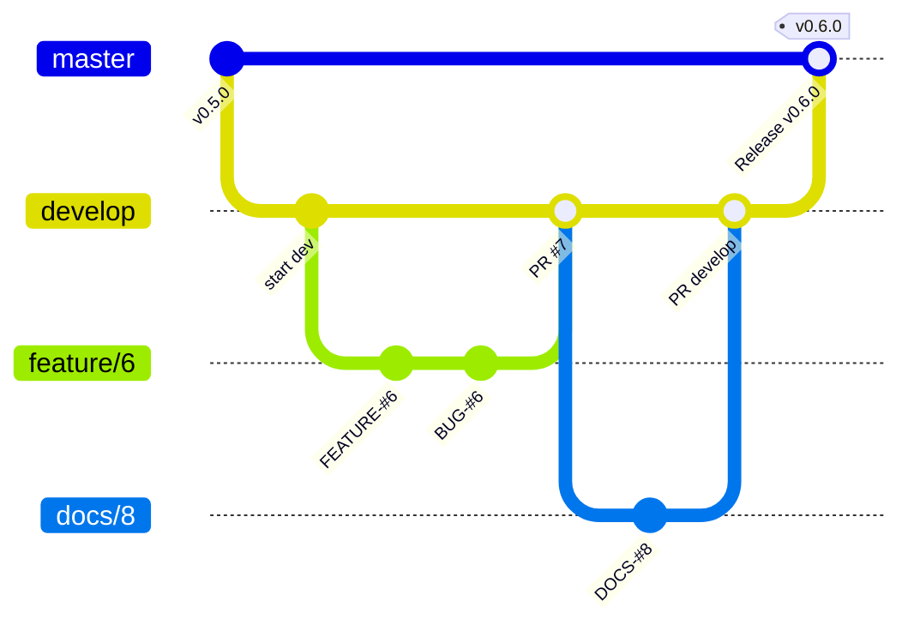

# Development Guide

## Getting Help

We use GitHub issues for tracking bugs and feature requests.

- 🐛 [Bug Report](https://github.com/linux-profile/email-profile/issues/new/choose)
- 📕 [Documentation](https://github.com/linux-profile/email-profile/issues/new/choose)
- 🚀 [Feature Request](https://github.com/linux-profile/email-profile/issues/new/choose)
- 💬 [General Question](https://github.com/linux-profile/email-profile/issues/new/choose)

## Development Setup

```bash
git clone https://github.com/linux-profile/email-profile.git
cd email-profile

poetry install --all-extras
poetry shell
```

## Git Workflow

This project follows a **Git Flow** branching model. All development happens on the `develop` branch.



### Branch Naming

All branches must be created **from `develop`**:

| Type | Pattern | Example |
|------|---------|---------|
| Feature | `feature/<ISSUE-NUMBER>` | `feature/6` |
| Bug Fix | `bug/<ISSUE-NUMBER>` | `bug/12` |
| Documentation | `docs/<ISSUE-NUMBER>` | `docs/8` |

### Creating a Branch

```bash
git checkout develop
git pull origin develop
git checkout -b feature/123
```

## Commit Style

Every commit must follow the format:

```
<emoji> <TYPE>-#<ISSUE-NUMBER>: <Description>
```

| Icon | Type | Description |
|------|------|-------------|
| ⚙️ | FEATURE | New feature |
| 📝 | PEP8 | Formatting fixes following PEP8 |
| 📌 | ISSUE | Reference to issue |
| 🪲 | BUG | Bug fix |
| 📘 | DOCS | Documentation changes |
| 📦 | PyPI | PyPI releases |
| ❤️️ | TEST | Automated tests |
| ⬆️ | CI/CD | Changes in continuous integration/delivery |
| ⚠️ | SECURITY | Security improvements |

### Examples

```
⚙️ FEATURE-#6: Add sync and restore with parallel fetch
🪲 BUG-#6: Fix UID extraction from IMAP fetch response
📘 DOCS-#6: Add MkDocs Material documentation
📝 PEP8-#6: Apply ruff format to sync module
❤️ TEST-#6: Add tests for storage backend
📦 PyPI-#6: Add rich dependency
```

## Pull Requests

- Feature/bug/docs branches → open PR against **`develop`**
- Release branches → open PR against **`master`**

### Before Opening a PR

- [ ] Code follows the project style guidelines
- [ ] Tests added/updated and passing locally
- [ ] No new warnings introduced
- [ ] Documentation updated (if applicable)

## Code Quality

### Linting & Formatting

```bash
ruff check .
ruff format .
```

### Tests

```bash
pytest
```

### Pre-commit

```bash
pre-commit install
pre-commit run --all-files
```

## Project Structure

```
email_profile/
├── email.py                  # Main facade (Email class)
├── _internal.py              # Shared helpers
├── parser.py                 # RFC822 parser
├── providers.py              # Auto-discovery (DNS SRV, MX, known hosts)
├── retry.py                  # Exponential backoff
├── advanced.py               # Power-user re-exports
├── clients/
│   ├── imap/
│   │   ├── client.py         # IMAP session lifecycle
│   │   ├── mailbox.py        # Folder operations
│   │   ├── folders.py        # Folder mapping (EN/PT/ES)
│   │   ├── query.py          # Query builder (Q, Query)
│   │   ├── searches.py       # Lazy search (Where)
│   │   ├── fetch.py          # Fetch spec builder (F)
│   │   ├── protocol.py       # IMAP response parsers
│   │   ├── sync.py           # Server → storage
│   │   └── restore.py        # Storage → server
│   └── smtp/
│       ├── client.py         # SMTP session
│       └── sender.py         # Send / reply / forward
├── core/
│   ├── abc.py                # Abstract base classes
│   ├── credentials.py        # Credential resolution
│   ├── errors.py             # Custom exceptions
│   ├── status.py             # IMAP status validation
│   └── types.py              # Type aliases
├── models/
│   └── raw.py                # SQLAlchemy ORM
├── serializers/
│   ├── email.py              # Message DTO
│   └── raw.py                # RawSerializer DTO
└── storage/
    ├── db.py                 # Session factory
    └── sqlite.py             # SQLite backend
```
