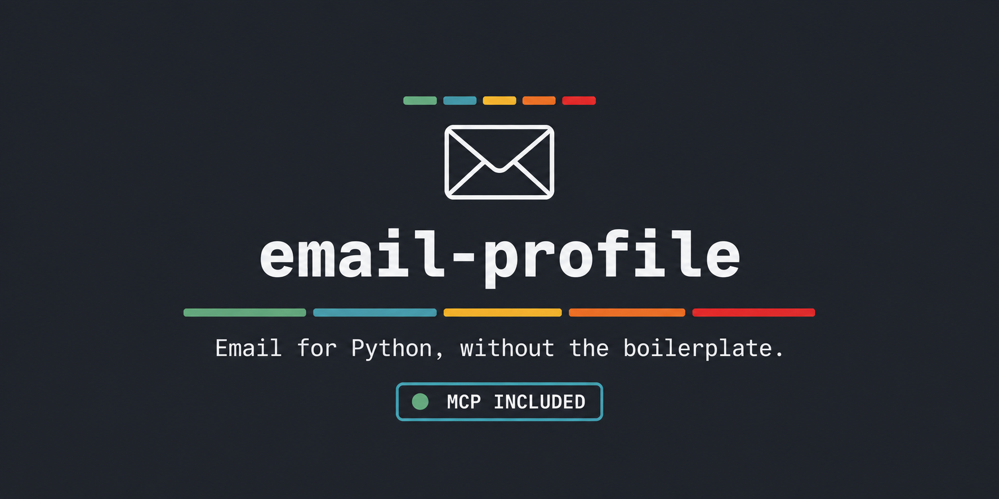

# Welcome to email-profile

  

  <a aria-label="Documentation" href="https://linux-profile.github.io/email-profile/">Documentation</a>
  &nbsp;•&nbsp;
  <a aria-label="Pypi" href="https://pypi.org/project/email-profile/">PyPI</a>
  &nbsp;•&nbsp;
  <a aria-label="Source Code" href="https://github.com/linux-profile/email-profile">Source Code</a>

A Python library for email management. Connect to any IMAP/SMTP server, read and send emails, sync your mailbox to a local database, and restore backups — all with a single, unified API. Or hand the same account to Claude, Cursor or any MCP client with the built-in [MCP server](nav/advanced/mcp-server.md).

{* ./docs_src/quickstart.py *}

Start with the basics [here](nav/tutorial/install.md), or go straight to the [MCP server](nav/advanced/mcp-server.md).

## Features

| Feature | Description |
|---|---|
| **Auto-discovery** | Detects IMAP/SMTP servers from email domain (50+ providers) |
| **Unified API** | IMAP + SMTP in a single `Email` class |
| **Query Builder** | Composable search with `Q` (AND, OR, NOT) and validated `Query` kwargs |
| **Sync** | Incremental backup from server to SQLite with progress bars |
| **Restore** | Upload emails back to server with duplicate detection |
| **Parallel** | Multi-threaded sync and restore with configurable workers |
| **Progress** | Rich progress bars with per-mailbox status |
| **Retry** | Exponential backoff on transient failures |
| **Send** | Send, reply, forward with HTML and attachments |
| **Storage** | Pluggable storage backend (SQLite default) |
| **Flags** | Read/unread, flag, delete, move, copy operations |
| **Context Manager** | `with Email(...) as app:` for automatic cleanup |
| **MCP Server** | 14 tools + 4 prompts for Claude Code, Claude Desktop, Cursor — read-only until you opt in |
| **Plugin** | Claude Code plugin with skills that gate sending behind your approval |

## Getting Help

We use GitHub issues for tracking bugs and feature requests.

- 🐛 [Bug Report](https://github.com/linux-profile/email-profile/issues/new/choose)
- 📕 [Documentation](https://github.com/linux-profile/email-profile/issues/new/choose)
- 🚀 [Feature Request](https://github.com/linux-profile/email-profile/issues/new/choose)
- 💬 [General Question](https://github.com/linux-profile/email-profile/issues/new/choose)

## License

This project is licensed under the terms of the MIT license.
