# Sync and Restore

## Sync (server to local database)

{* ./docs_src/sync_and_restore.py ln[8:10] *}

### Output

## Sync One Mailbox

{* ./docs_src/sync_and_restore.py ln[12:14] *}

## Restore (local database to server)

{* ./docs_src/sync_and_restore.py ln[16:18] *}

### Output

## Restore One Mailbox

{* ./docs_src/sync_and_restore.py ln[20:22] *}

## Control Parallelism

{* ./docs_src/sync_and_restore.py ln[27:29] *}

## Full Code

{* ./docs_src/sync_and_restore.py *}

## Reference

- [Email](../reference/email.md)
- [Sync](../reference/sync.md)
- [Restore](../reference/restore.md)
- [SyncResult](../reference/sync-result.md)
